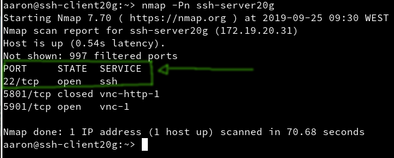
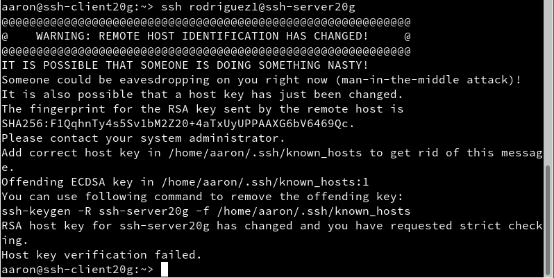

# Actividad 2: SSH

>Antes de comenzar, ponemos los nombres de host e IP's que se nos piden en nuestras máquinas, por ejemplo en GNU/Linux:
>

>Tampoco podemos olvidarnos de añadir en el servidor ssh a los clientes en el archivo */etc/hosts* .
>

>Realizamos algunas comprobaciones:
>
>
>

>Y para acabar con esta parte, creamos 4 usuarios:

>

## (2.2) Primera conexión SSH GNU/Linux
Cuando hayamos realizado los pasos anteriores, a parte de otros que hemos obviado, realizamos la comprobación.

Vamos al cliente (*ssh-client20g*) y hacemos ping al servidor (*ssh-server20g*).


Comprobamos que el puerto 22 está abierto, para ello hacemos uso del "nmap".



Y ahora nos iremos conectando con nuestros usuarios desde el cliente:


Y seguidamente comprobaremos el fichero ./ssh/known_hosts:


>### Anexo: Windows
>También lo probamos en Windows haciendo uso de PuTTY
> 
> 

## (3.2) Comprobar cambio de clave del servidor SSH



Lo hemos arreglado gracias al propio mensaje de advertencia:


## (5) Autenticación mediante clave pública
Desde la máquina GNU/Linux cliente, **sin usar root**, creamos un nuevo par de claves para el usuario.
```
ssh-keygen -t rsa

sh-copy-id rodriguez4@ssh-server20g
```

Comprobamos que, efectivamente, desde el cliente Linux no pide password, pero sí la pide desde Windows.


## (6) Uso de SSH como túnel para X
Lo primero que haremos será entrar a nuestro servidor e instalar allí una aplicación. En mi caso será Geany.
En "/etc/ssh/sshd_config" debemos asegurarnos que la opción **X11Forwarding** esté en **yes**.


Ahora, verifiquemos que la aplicación está instalada en el servidor pero no en nuestro cliente:


Comprobemos el  funcionamiento de nuestra aplicación:


## (8.1) Restricción sobre un usuario
Vamos a modificar SSH para que rodriguez2 tenga permiso denegado desde los clientes.

Modificaremos el fichero "/etc/ssh/sshd_config" de la siguiente manera:


Ahora reiniciamos el servicio con *sudo systemctl restart sshd*.

Comprobamos que, entrando con "rodriguez2", nuestra contraseña resulta inválida y no podemos entrar. Ni desde Linux ni desde Windows.


