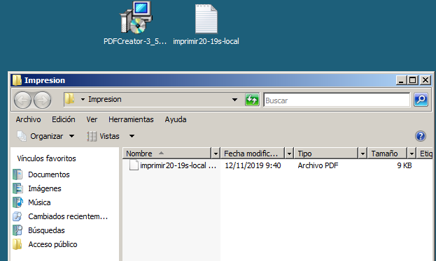
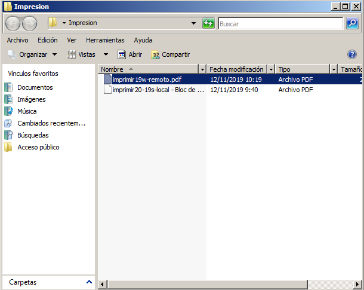
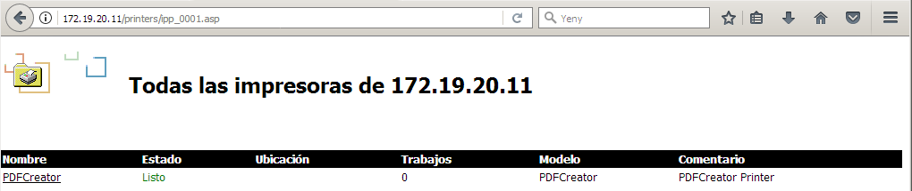
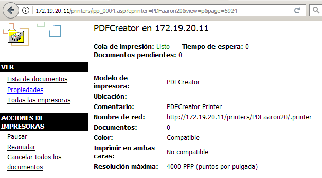
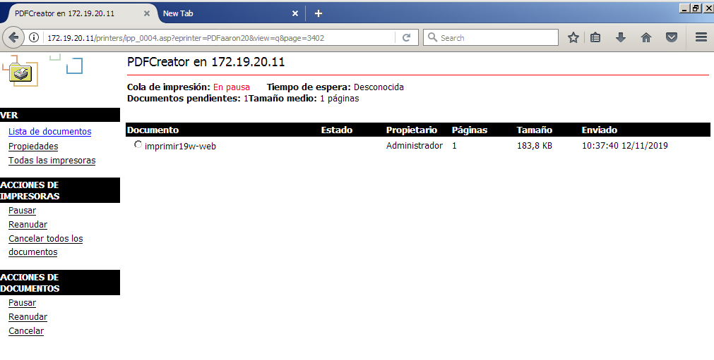
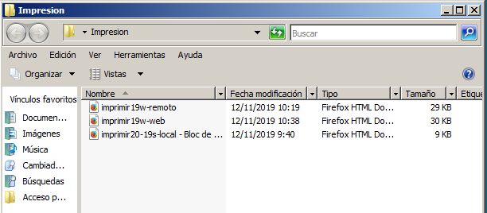

# Servidor de Impresión en Windows

###  *Componentes del grupo: Aarón Rguez. Pérez y Ricardo S. Rodríguez 
Pinho.*

## (1.3) Comprobar que se imprime de forma local

## (2.2) Comprobar que se imprime de forma remota

## (3.3) Comprobar que se imprime desde el navegador

