# SAMBA - OpenSUSE

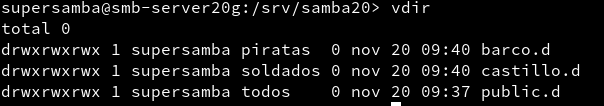

### (1.4 y 1.5) Fichero smb.conf 	

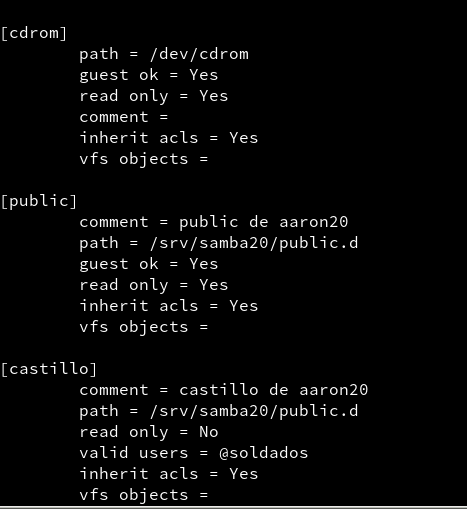

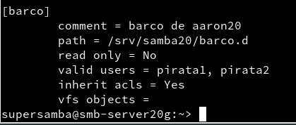

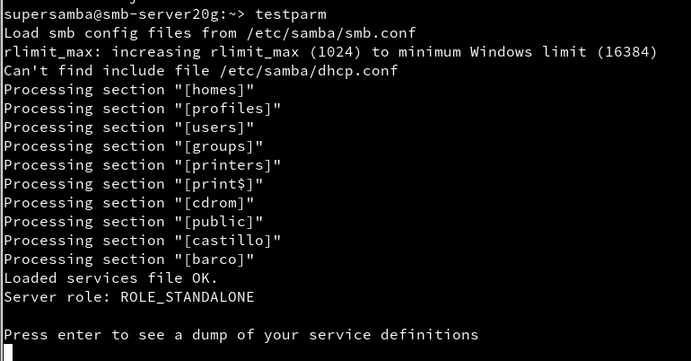

### (2.1 y 2.2) Conexión SMB desde Windows

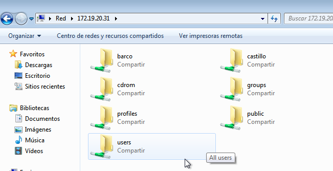

Accedemos con el usuario "invitado" al recurso compartido
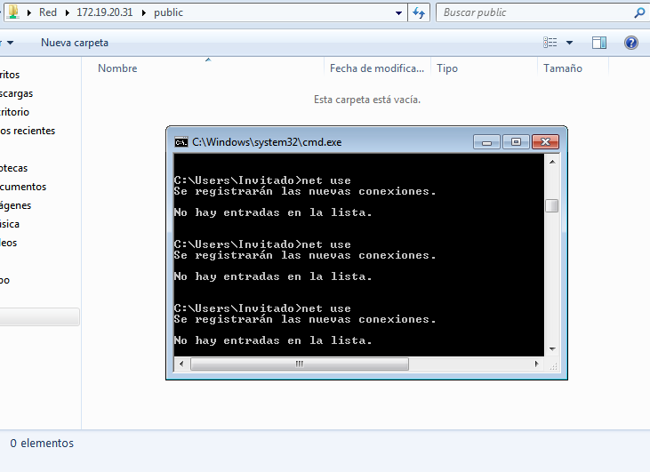

Accedemos con "soldado"
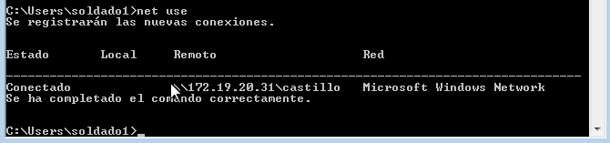

Accedemos con "pirata"
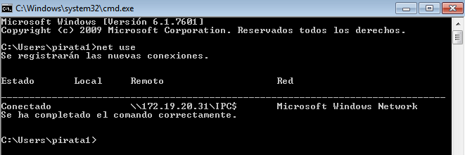

Y en el servidor, comprobamos con el comando ```sudo smbstatus```:
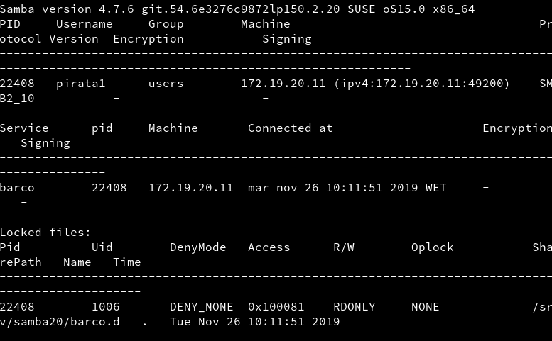

Por comandos...

Vemos los recursos de esta máquina.
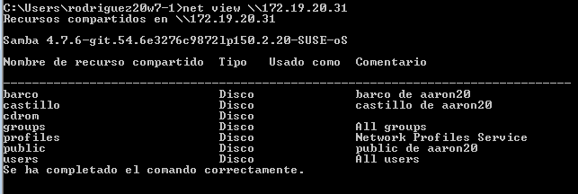
Creamos un recurso compartido y lo montamos en S:.
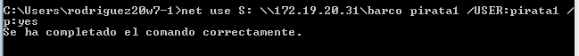

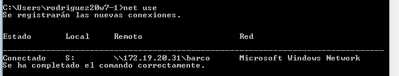

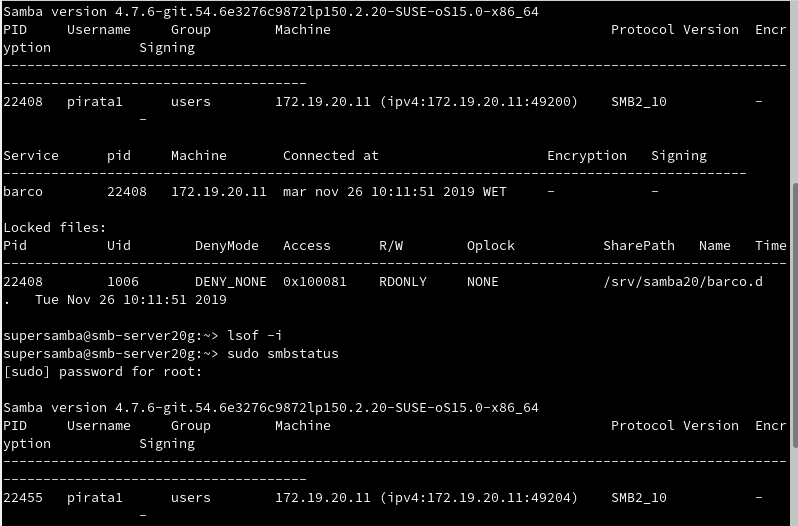

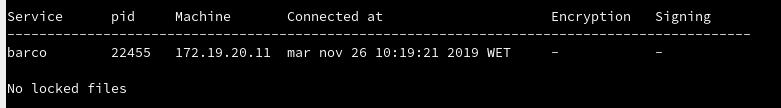

### (3.1 y 3.2) Conexión SMB desde GNU/Linux 	
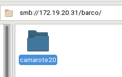

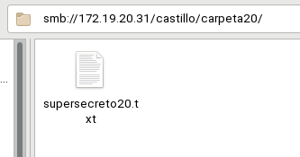

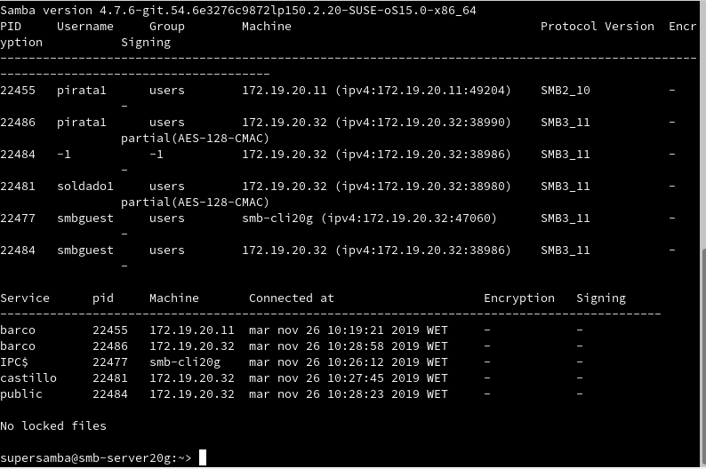

Por comandos...

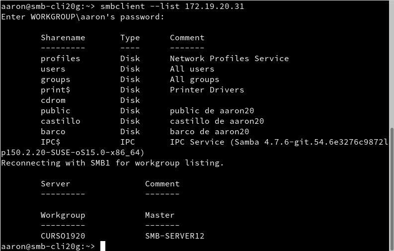

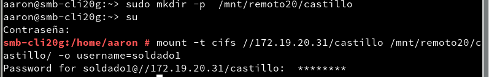

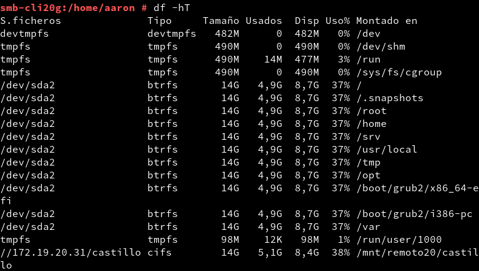
```sudo smbstatus```
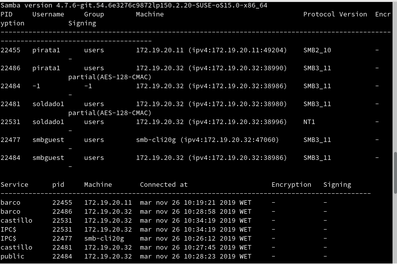
```lsof -i```
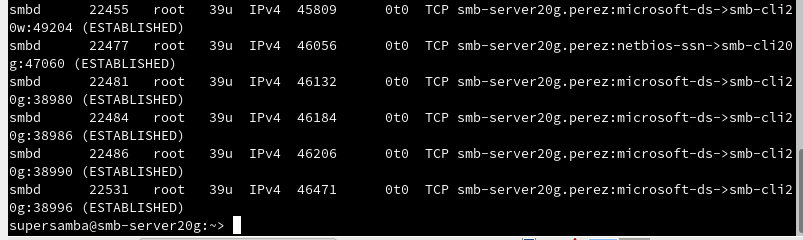

### (3.3) Montaje automático
