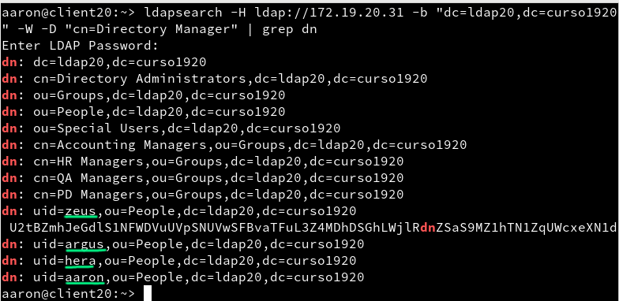

# Servidor 389-DS - OpenSUSE
## [1.1] Nombre de equipo FQDN


Ahora, lo conveniente sería abrir los puertos necesarios del cortafuegos. Pero vamos a comprobar si se abren automáticamente con la instalación.

## [2.1] Instalación del paquete
Es tan simple como `zypper in 389-ds` y luego ejecutar el script que se descarga en `/usr/sbin/setup-ds.pl`

Lo dejamos todo por defecto, excepto los siguientes puntos.
- `Setup type: 2. Typical`
- `FQDN: server20.curso1920`
- `DS identifier: ldap20`
- `Suffix (valid DN): dc=ldap20,dc=curso1920`

Nos dará un error con el módulo *selinux*, pero de momento no indagaremos en él.

## [2.2] Comprobamos el servicio


>El cortafuegos se modificó automáticamente :+1:

## [2.3] Comprobar el acceso al contenido


- Observamos que existen las OU Groups y People :+1:


- Hemos realizado la misma consulta pero usando usuario y clave.

## [3.1] Buscar Unidades Organizativas


## [3.2] Agregar usuarios

Para ello usaremos un fihero **ldif** como el siguiente. Yo lo llamaré "aaron-add.ldif".

>NO OLVIDAR: Cambiar ldapXX por nuestro número. En mi caso "ldap20"


Y lo añadimos.


## [3.3] Comprobar nuevo usuario


## [4.1] Slappasswd
Mi contraseña aparece encriptada por defecto, así que no *parece* necesario usar esta herramienta. Pero en los archivos de configuración SÍ que el fichero está en texto plano, y es inseguro. Para arreglar esto, usaremos "slappasswd".
Se usa así:
```
$ slappasswd -h {SSHA}
New password:
Re-enter new password:
{SSHA}5uUxSgD1ssGkEUmQTBEtcqm+I1Aqsp37
```

## [4.2] Agregar más usuarios
De la misma manera que antes. Creando el ".ldif" y luego ejecutando el comando la igual que aquí


Yo he creado los usuarios
- Zeus
- Hera
- Argus

## [4.3] Comprobar los usuarios creados


