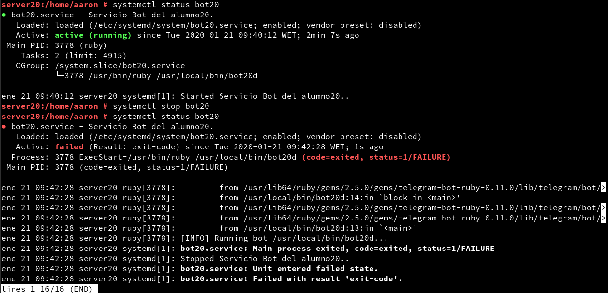
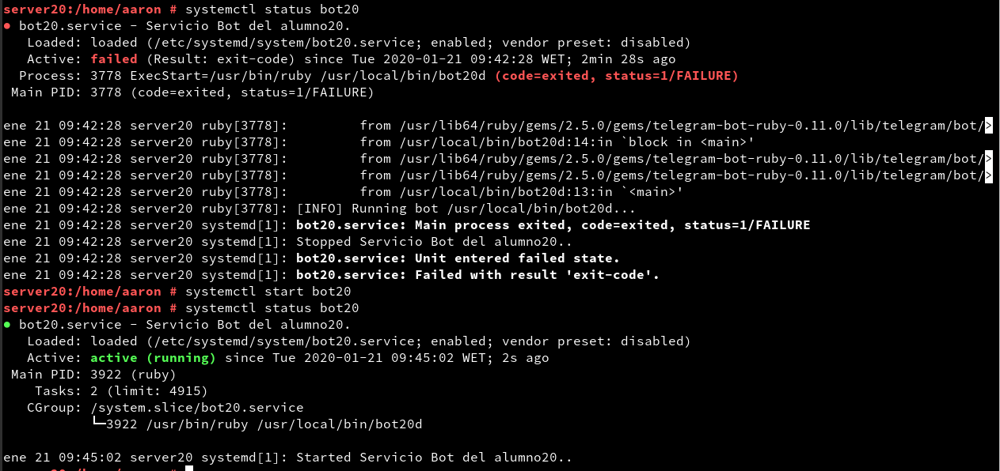
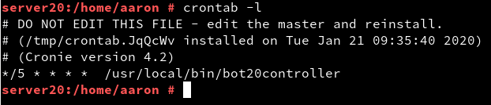
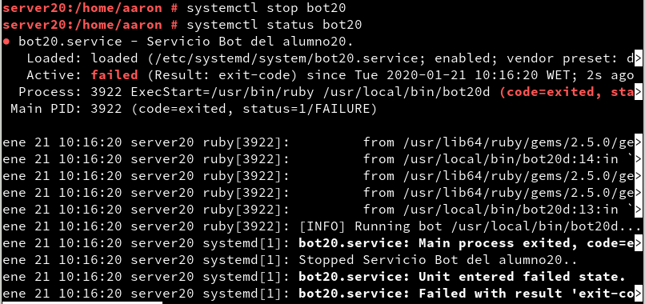
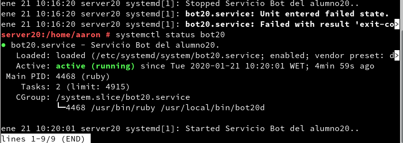

# Bot service (con Telegram)

## 1.4
### Script del bot (*/usr/local/bin/bot20d*):
```ruby
#!/usr/bin/env ruby

require 'telegram/bot'

# token:
# 1. Write your TOKEN value into "token" variable or
# 2. Create a local file "hiden.token" with your TOKEN value inside
token =%x[cat /etc/bot20/token].strip
bot_username = '@rodriguez20_bot'

puts "[INFO] Running bot #{$0}..."

Telegram::Bot::Client.run(token) do |bot|
  bot.listen do |message|
    puts " => #{message.text}"
    if message.text == "/hello"
      bot.api.send_message(chat_id: message.chat.id, text: "Hello Word!")
    elsif message.text == "/byebye"
      bot.api.send_message(chat_id: message.chat.id, text: "Bye bye!")
    elsif message.text == "/help"
      bot.api.send_message(chat_id: message.chat.id, text: ''' Comandos útiles:
      /hello -> ¡Hola!
      /byebye -> ¡Adiós!
      /users -> Muestra los usuarios del sistema
      /currentuser -> Usuario actual
      /ping -> Hace ping a 8.8.8.8''')
    elsif message.text == "/users"
	  users = `passwd -S -a | cut -d" " -f1`
	  bot.api.send_message(chat_id: message.chat.id, text: "#{users}")
    elsif message.text == "/currentuser"
	  user = `whoami`
	  bot.api.send_message(chat_id: message.chat.id, text: "#{user}")
	elsif message.text == "/ping"
	  ping = `ping 8.8.8.8 -c4`
      bot.api.send_message(chat_id: message.chat.id, text: "Haciendo PING...#{ping}")
    end
  end
end

```
### URL del vídeo donde se muestra en funcionamiento:

[https://www.youtube.com/watch?v=WpLSzoVuo1w](https://www.youtube.com/watch?v=WpLSzoVuo1w)

## 2.4

### Fichero de configuración del servicio (*/etc/systemd/system/bot20.service*)
```
[Unit]
Description=Servicio Bot del alumno20.
After=network.service

[Service]
Type=simple
ExecStart=/usr/bin/ruby /usr/local/bin/bot20d

[Install]
WantedBy=multi-user.target
```
### Capturas de inicio y parada del servicio:





## 3.2

### Script del controlador
```ruby
#!/usr/bin/env ruby


status=`systemctl status bot20 | grep Active`.split()

if status[1] != 'active'
   `systemctl start bot20`
end

```

### Tarea programada en crontab



### Comprobación de su funcionamiento
Paramos el servicio...



Esperamos 5 minutos y comprobamos el estado del servicio...


