## 3.3. Comprobar proyecto 1
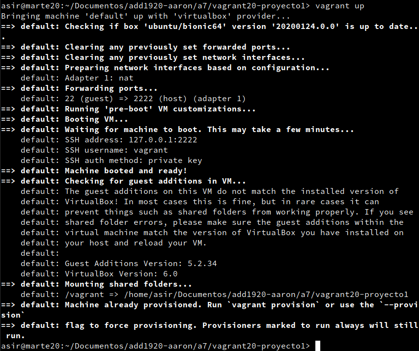

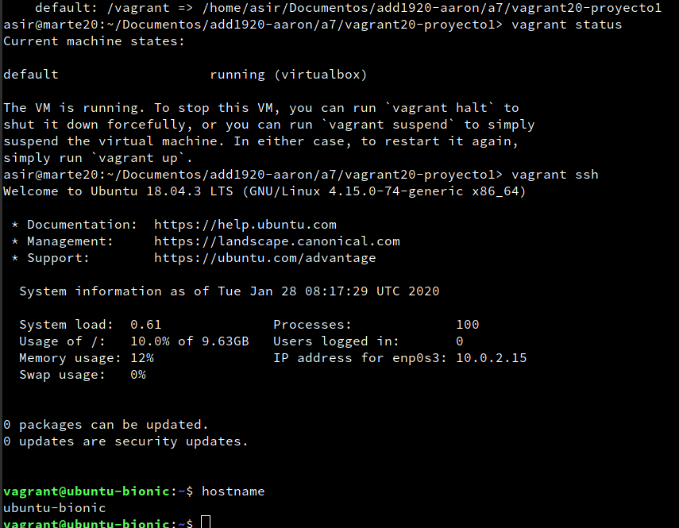

## 5.2. Comprobar proyecto 2

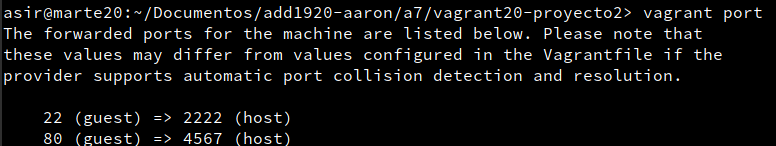

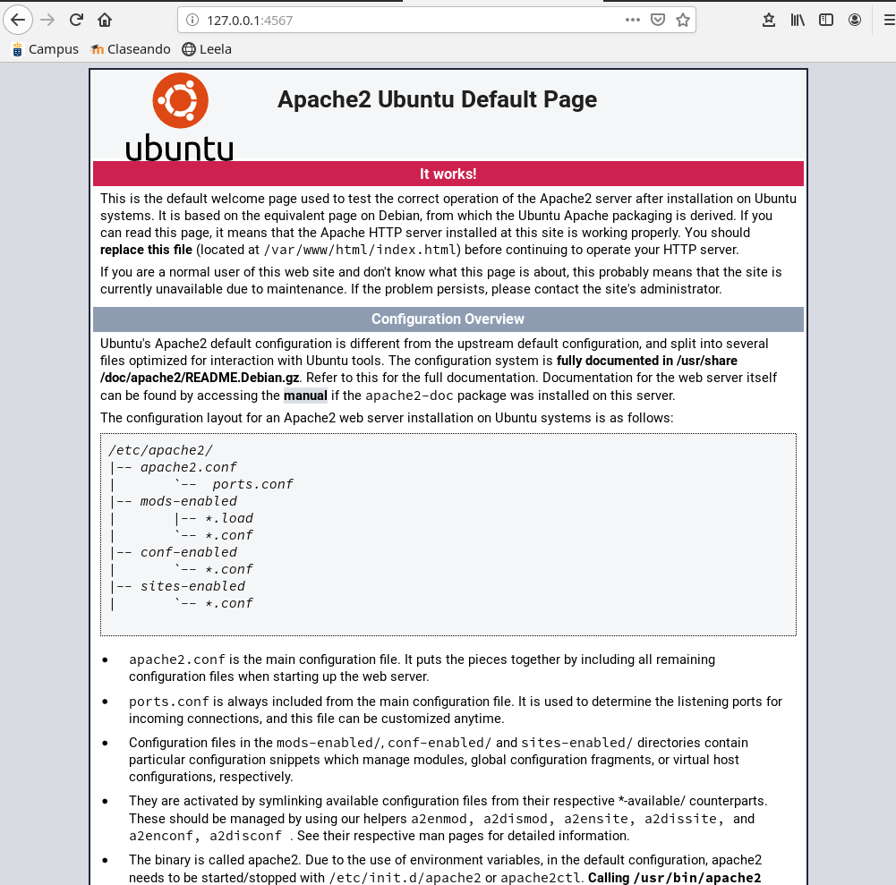

## 6.1. Suministro Shell Script

Tras crear el directorio, creamos un proyecto Vagrant y un script `install_apache.sh`

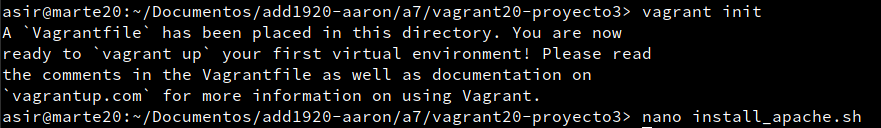

Su contenido es el siguiente:

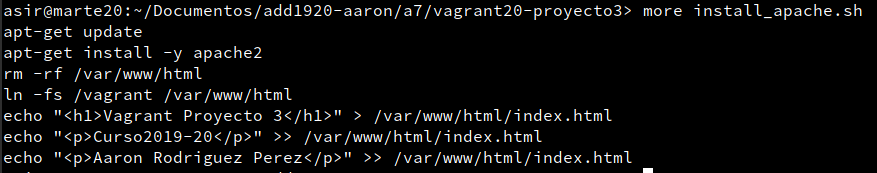

Entonces, debemos indicarle al Vagrantfile que ejecute el script anterior:

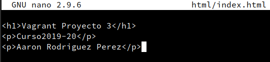

Creamos la MV:

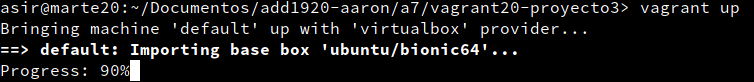

Verificamos:

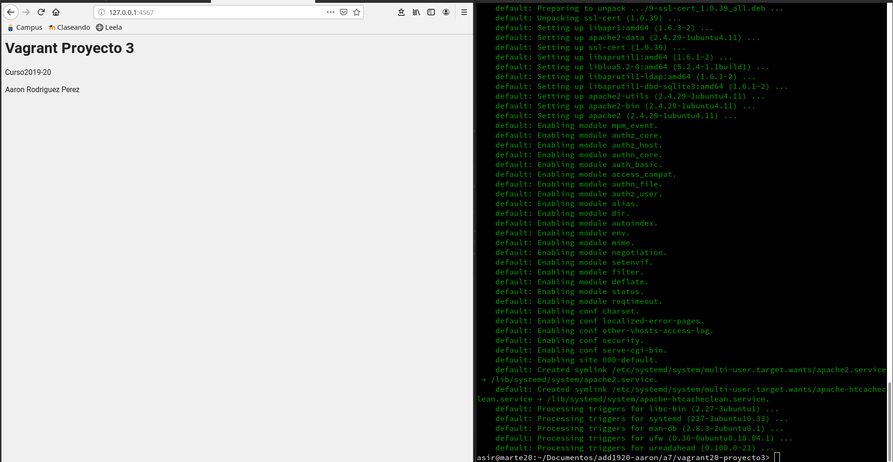

## 6.2. Suministro Puppet

En el Vagrantfile... (debemos instalar Puppet o no funcionará, por esto usaremos `installpuppet.sh`)
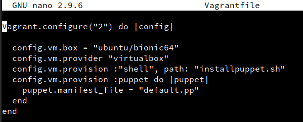

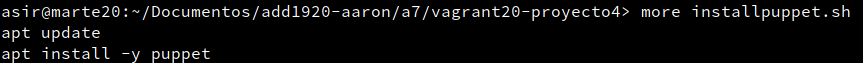

En el `default.pp` añadimos los paquetes que queramos instalar, en mi caso elegí "geany".

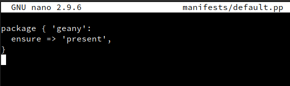

Creamos la máquina con `vagrant up` y comprobamos si se ha instalado el geany o no. Para ello, nos conectamos con `vagrant ssh` y comprobamos si está instalado el paquete con `dpkg -s geany`

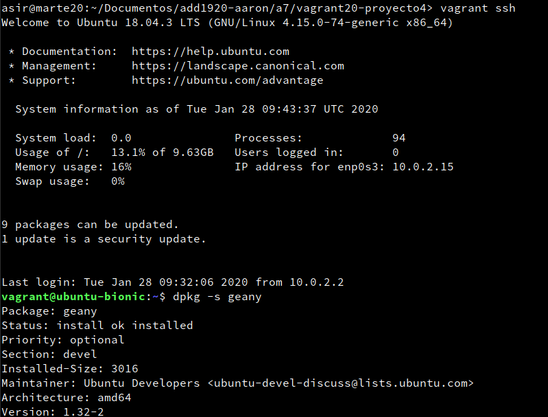

Ha funcionado :+1:

## 7.2. Crear Box Vagrant

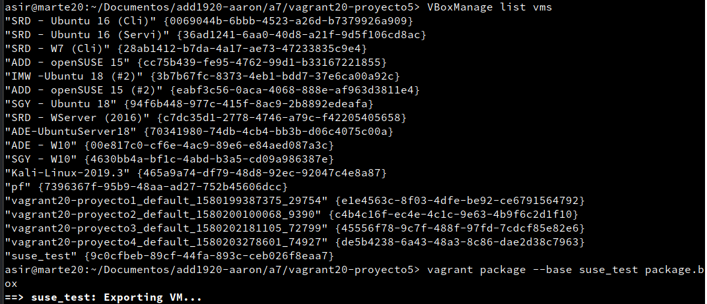

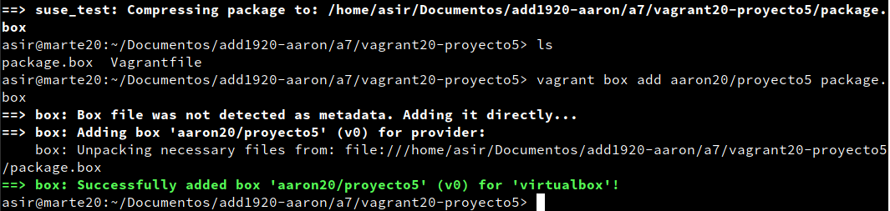

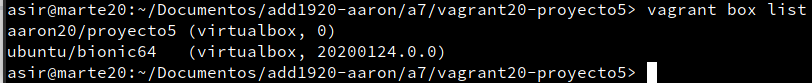

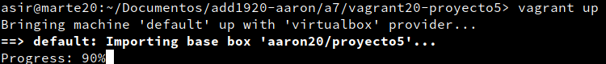

Y comprobamos conectándonos por ssh

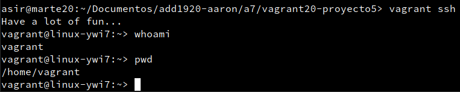
