# **U7 - P2: Salt-stack**
## 1. Definición
`Hay varias herramientas conocidas del tipo gestor de infrastructura como Puppet, Chef y Ansible. En esta actividad vamos a practicar Salt-stack con OpenSUSE.`

## 2. Preparativos
Nuestras máquinas tendrán los siguientes nombres e IP's.

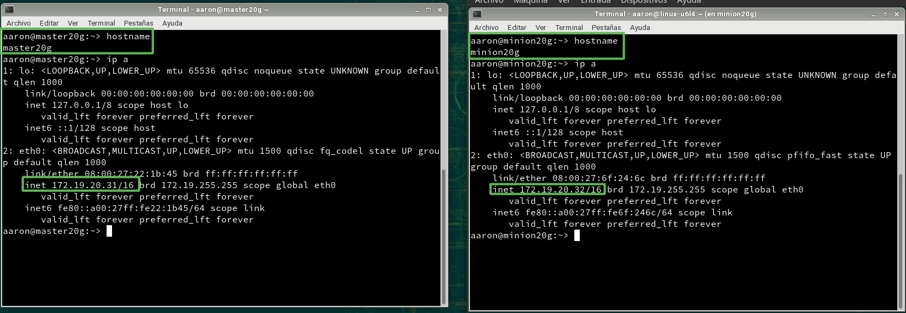

No podemos olvidarnos de configurar `/etc/hosts`

- En Máster

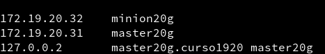

- Y en Minion

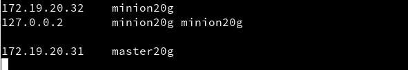

## 3. Máster: instalación y configuración
Instalamos "salt-master"

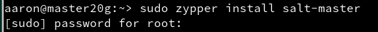

Modificamos `/etc/salt/master` de esta manera:

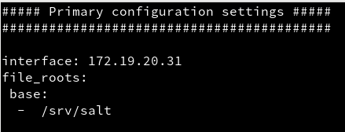

Activamos el servicio para que se inicie en el arranque y lo iniciamos.

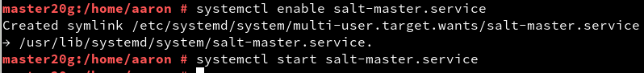

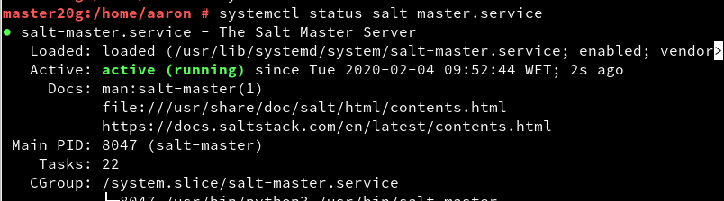

Ahora consultamos los minions aceptados por el máster. De momento, no hay ninguno.


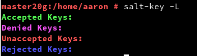

## 4. Minion
### 4.1 Instalación y configuración

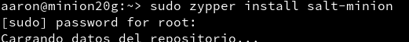

Modificamos el archivo "minion" de "/etc/salt/" especificando quién es el máster.

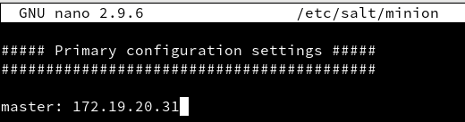


>En este punto hemos tenido que desactivar el firewall, al menos momentáneamente hasta averiguar qué configuración debemos aplicarle

Activamos e iniciamos el servicio.

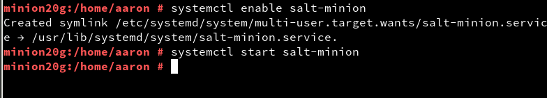

Y comprobamos que no tenemos Apache2 instalado:
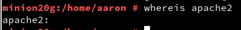

### 4.2 Aceptación desde el Máster
Vemos que Máster ha recibido la petición de Minion.

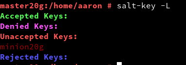

Así que la aceptamos y comprobamos.

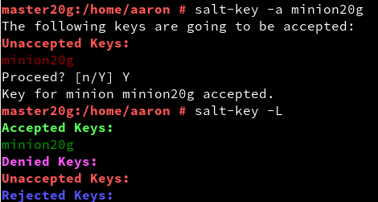

### 4.3. Comprobamos la conectividad

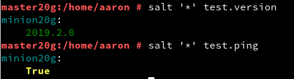

## 5. Salt States
### 5.1 Preparar el directorio para los estados
Creamos los directorios `/srv/salt/base` y `/srv/salt/devel`

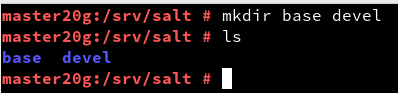

Ahora, crearemos el archivo "roots.conf" con el contenido siguiente. Y posteriormente reiniciamos el servicio "máster".

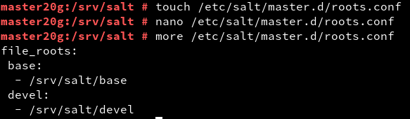

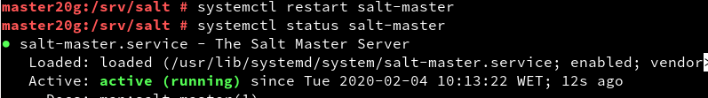

>Hemos creado los directorios para:
>- base = para guardar nuestros estados.
>- devel = para desarrollo o para hacer pruebas.

### 5.2 Crear un nuevo estado

Creamos el fichero "sls" siguiente: `/srv/salt/base/apache/init.sls`

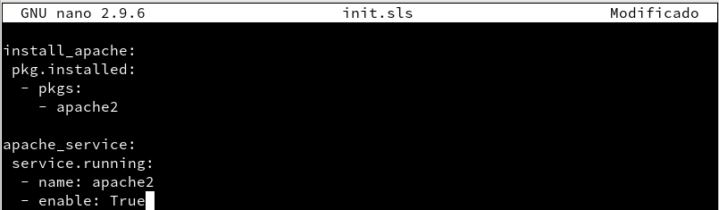

### 5.3 Asociar Minions a estados

Crear `/srv/salt/base/top.sls` donde asociamos a todos los Minions con el estado que hemos definido. El contenido es el siguiente:


### 5.4 Comprobar: estados definidos

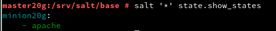

### 5.5 Aplicar el nuevo estado
Primero, probamos que no haya errores en las definiciones:

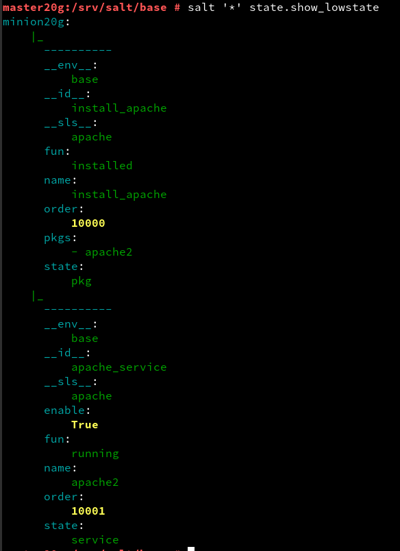

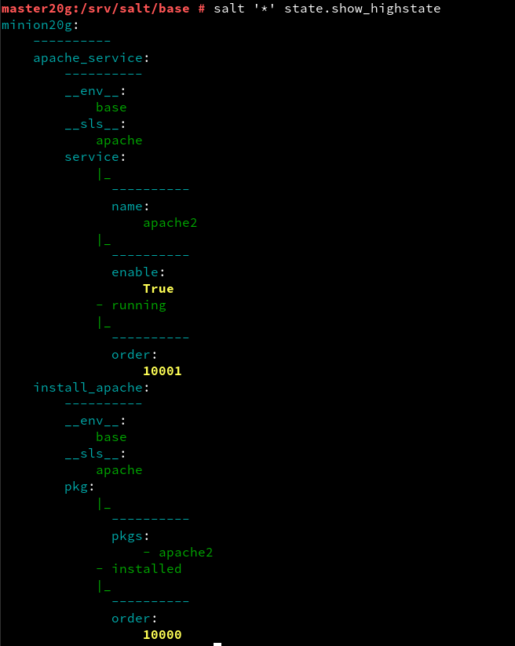

Una vez hecho esto, aplicamos el nuevo estado en todos los minions.


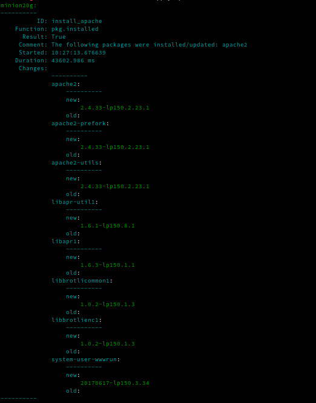

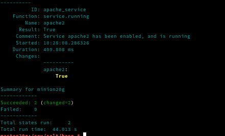

Comprobamos en el minion si se instaló:


## 6. Crear más estados
### 6.1 Crear estado "users"
- El **objetivo** es crear dos usuarios y un grupo (al que pertencerán)

>No olvidemos que tenemos que añadir este nuevo estado a "top.sls".
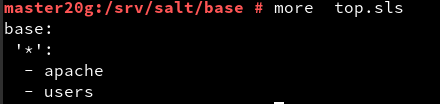

>Y, antes de aplicar, comprobar con
```
    salt '*' state.show_lowstate
    salt '*' state.show_highstate
```

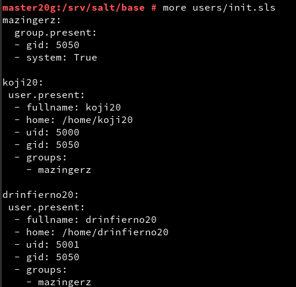

Y aplicarlo.

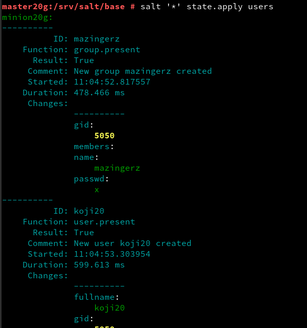

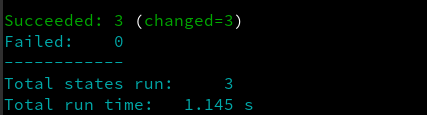

Comprobamos en el cliente (Minion) si se han creado los usuarios y el grupo.

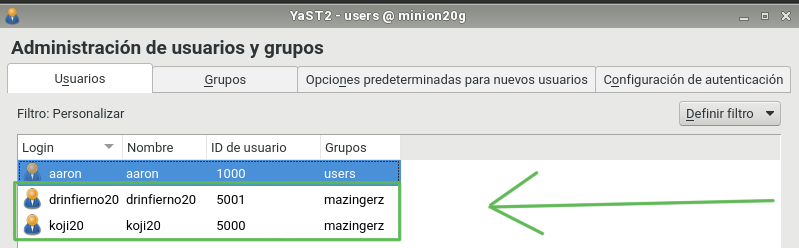

¡Perfecto! :+1:
### 6.2 Crear estado "directories"

- El **objetivo** es crear las carpetas private (700), public (755) y group (750) en el home del usuario koji20.

Lo haremos de esta manera:

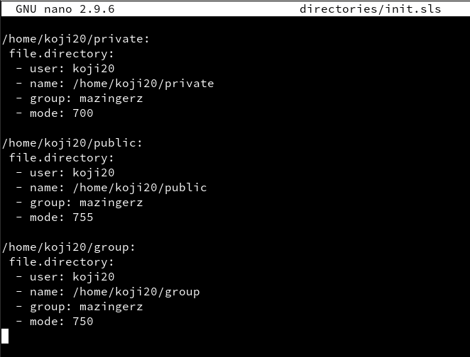

Lo añadimos a "top.sls" y aplicamos.


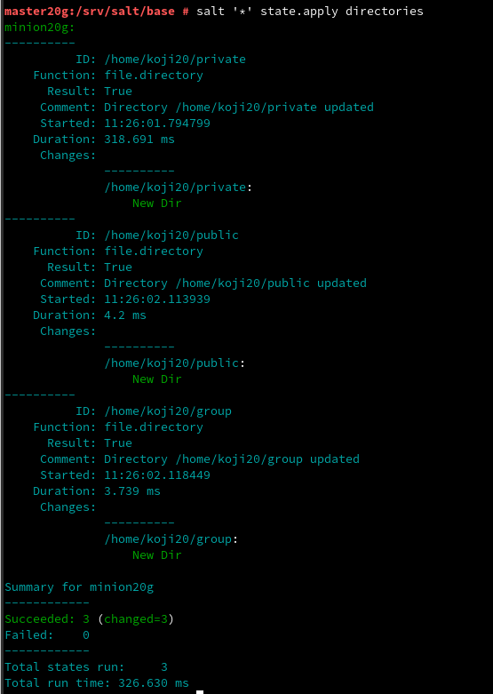

Por último, comprobamos.

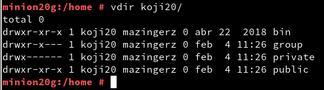

¡Bien! :+1:

## 7. Añadir Minion de otro SO (W7)
>Añadir a /etc/hosts
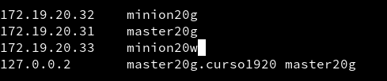
Y en Windows también
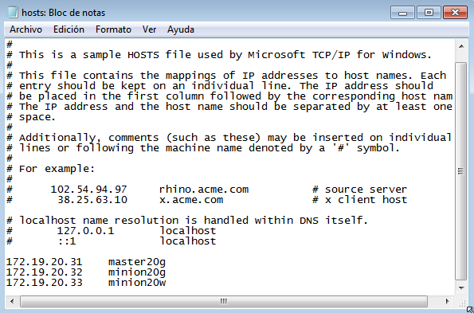

Instalamos "salt-minion"

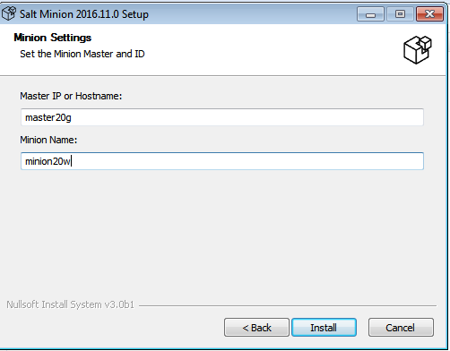

Aceptamos al minion en el máster, como hicimos anteriormente en OpenSUSE.

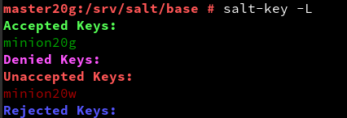

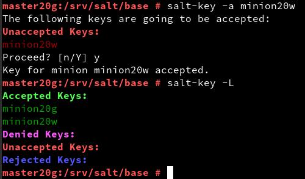

¡Y ya estaría! :smile: 
