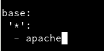

# Salt-stack
## 1. Definición
`Hay varias herramientas conocidas del tipo gestor de infrastructura como Puppet, Chef y Ansible. En esta actividad vamos a practicar Salt-stack con OpenSUSE.`

## 2. Preparativos
Nuestras máquinas tendrán los siguientes nombres e IP's.

No podemos olvidarnos de configurar `/etc/hosts`

- En Máster

- Y en Minion

## 3. Máster: instalación y configuración
Instalamos "salt-master"

Modificamos `/etc/salt/master` de esta manera:

Activamos el servicio para que se inicie en el arranque y lo iniciamos.

Ahora consultamos los minions aceptados por el máster. De momento, no hay ninguno.

## 4. Minion
### 4.1 Instalación y configuración

Modificamos el archivo "minion" de "/etc/salt/" especificando quién es el máster.

>En este punto hemos tenido que desactivar el firewall, al menos momentáneamente hasta averiguar qué configuración debemos aplicarle

Activamos e iniciamos el servicio.

Y comprobamos que no tenemos Apache2 instalado:

### 4.2 Aceptación desde el Máster
Vemos que Máster ha recibido la petición de Minion.

Así que la aceptamos y comprobamos.

### 4.3. Comprobamos la conectividad

## 5. Salt States
### 5.1 Preparar el directorio para los estados
Creamos los directorios `/srv/salt/base` y `/srv/salt/devel`

Ahora, crearemos el archivo "roots.conf" con el contenido siguiente. Y posteriormente reiniciamos el servicio "máster".

>Hemos creado los directorios para:
>- base = para guardar nuestros estados.
>- devel = para desarrollo o para hacer pruebas.

### 5.2 Crear un nuevo estado

Creamos el fichero "sls" siguiente: `/srv/salt/base/apache/init.sls`

### 5.3 Asociar Minions a estados

Crear `/srv/salt/base/top.sls` donde asociamos a todos los Minions con el estado que hemos definido. El contenido es el siguiente:

### 5.4 Comprobar: estados definidos

### 5.5 Aplicar el nuevo estado
Primero, probamos que no haya errores en las definiciones:

Una vez hecho esto, aplicamos el nuevo estado en todos los minions.

Comprobamos en el minion si se instaló:

## 6. Crear más estados
### 6.1 Crear estado "users"

### 6.2 Crear estado "directories"

## 7. Añadir Minion de otro SO
