# DOCKER

## 1. Contenedores con Docker

### 1.1. Introducción

>Es muy común que nos encontremos desarrollando una aplicación, y llegue el momento que decidamos tomar todos sus archivos y migrarlos, ya sea al ambiente de producción, de prueba, o simplemente probar su comportamiento en diferentes plataformas y servicios.

>Para situaciones de este estilo existen herramientas que, entre otras cosas, nos facilitan el embalaje y despliegue de la aplicación, es aquí donde entra en juego Docker.

>Esta herramienta nos permite crear lo que ellos denominan contenedores, lo cual son aplicaciones empaquetadas auto-suficientes, muy livianas, que son capaces de funcionar en prácticamente cualquier ambiente, ya que tiene su propio sistema de archivos, librerías, terminal, etc.

>Docker es una tecnología contenedor de aplicaciones construida sobre LXC.

### 1.2. Requisitos
- OpenSUSE.
- Kernel 3.10 o superior.

### 1.3. Habilitar el acceso a la red externa a los contenedores
- Para que el contenedor tenga acceso a la red exterior, debemos activar la opción `IP_FORWARD` (`net.ipv4.ip_forward`)

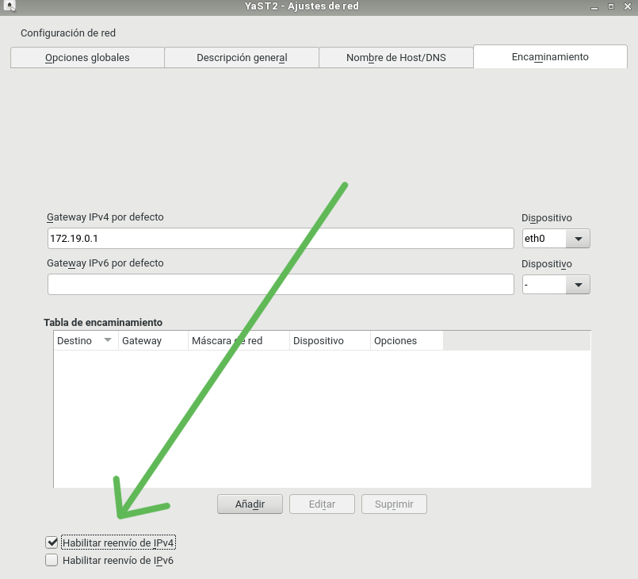
- Reiniciar para que se apliquen los cambios.


## 2. Instalación y primeras pruebas

### 2.1. Instalación
- Ejecutar los siguientes comandos como superusuario:

```
zypper in docker        # Instala docker
systemctl start docker  # Inicia el servicio (El comando "docker daemon" hace el mismo efecto)
docker version          # Información de las versiones cliente y servidor
```

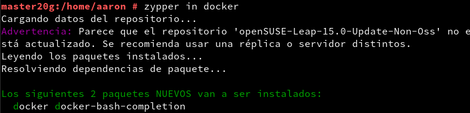

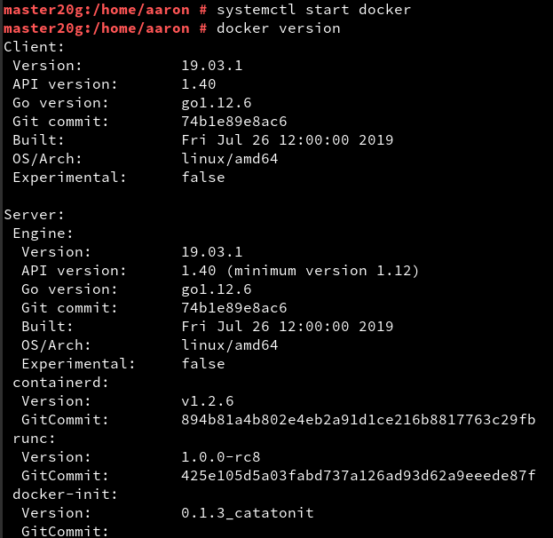


- Salir de la sesión y volver a entrar con nuestro usuario


### 2.2. Primera prueba
- Ejecutar con nuestro usuario para comprobar que funciona:

```
docker images           # Muestra las imágenes descargadas hasta ahora
                        # No debe haber ninguna
docker ps -a            # Muestra todos los contenedores creados
                        # No debe haber ninguno
```
Nos da error de permisos.

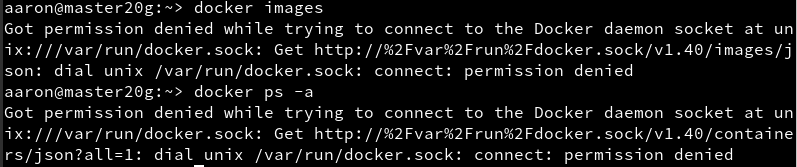

Así que usaremos "sudo".

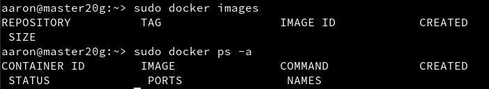

- Primera prueba:

```
docker run hello-world  # Descarga y ejecuta un contenedor
                        # con la imagen "hello-world"
                        # Sólo muestra un mensaje en pantalla.
docker images           # Vemos la nueva imagen
docker ps -a            # El contenedor está estado 'Exited'
```
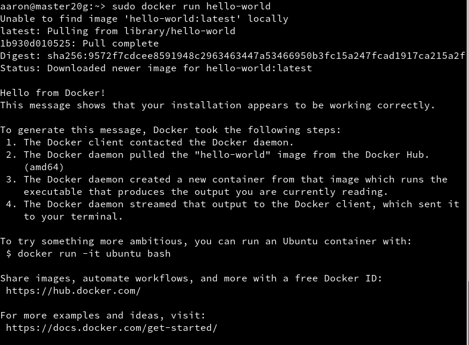

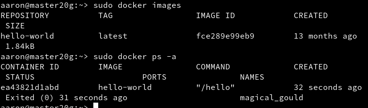

### 2.3. Teoría
Tabla de referencia para no perderse:

| Software   | Base   | Sirve para crear   | Aplicaciones |
| ---------- | ------ | ------------------ | ------------ |
| VirtualBox | ISO    | Máquinas virtuales | N |
| Vagrant    | Box    | Máquinas virtuales | N |
| Docker     | Imagen | Contenedores       | 1 |


Información sobre otros comandos útiles:

| Comando                     | Descripción |
| --------------------------- | ------------------- |
| `docker stop CONTAINERID`   | parar un contenedor |
| `docker start CONTAINERID`  | iniciar un contenedor |
| `docker attach CONTAINERID` | conectar el terminal actual con el interior de contenedor |
| `docker ps`                 | mostrar los contenedores en ejecución |
| `docker ps -a`              | mostrar todos los contenedores (en ejecución o no) |
| `docker rm CONTAINERID`     | eliminar un contenedor |
| `docker rmi IMAGENAME`      | eliminar una imagen |

---
## 3. Creación manual

### 3.1. Crear una imagen manualmente

```
docker images        # Vemos las imágenes disponibles localmente
docker search debian # Buscamos en los repositorios de Docker Hub
                     # contenedores con la etiqueta `debian`
docker pull debian:9 # Descargamos una imagen `debian:9` en local
docker images
docker ps -a         # Vemos todos los contenedores
docker ps            # Vemos sólo los contenedores en ejecución
```

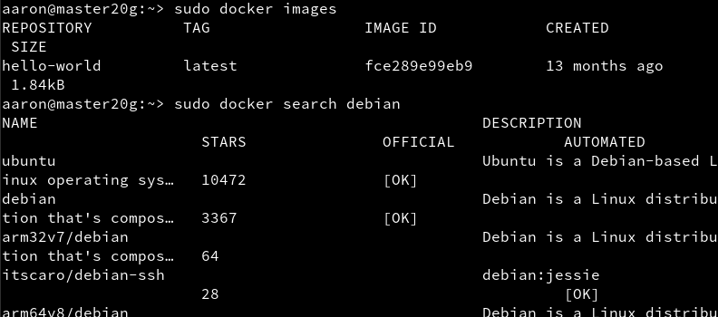

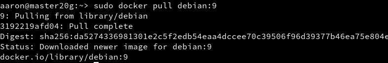

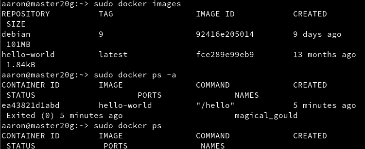

- Crear un contenedor de nombre "con_debian" a partir de la imagen "debian:9" y ejecutar `/bin/bash`

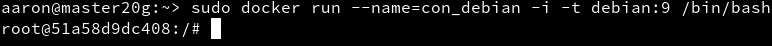

### 3.2. Personalizar el contenedor
```
root@IDContenedor:/# cat /etc/motd            # Comprobamos que estamos en Debian
root@IDContenedor:/# apt-get update
root@IDContenedor:/# apt-get install -y nginx # Instalamos nginx en el contenedor
root@IDContenedor:/# /usr/sbin/nginx          # Iniciamos el servicio nginx
root@IDContenedor:/# ps -ef          
```

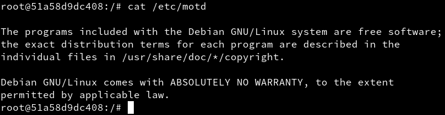


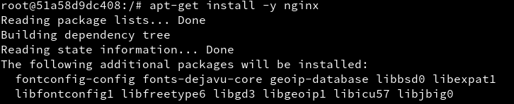


> Hemos tenido que instalar "ps" con el comando `apt-get install procps`

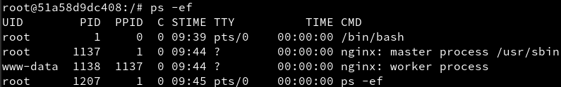

- Creamos un fichero `holamundo.html`

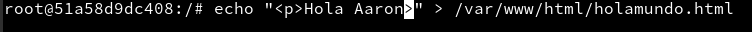

### 3.3. Crear una imagen a partir del contenedor
- Primero debemos averiguar el ID de nuestro contenedor. Para ello, abrimos otro terminal y ejecutamos `docker ps`

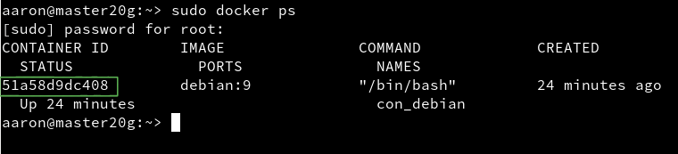

- Con esto, podemos crear la nueva imagen a partir de los cambios que realizamos sobre la imagen base.

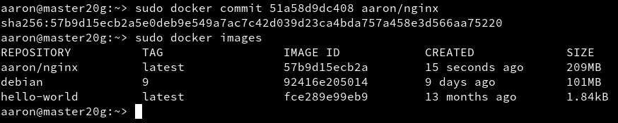

```
docker ps
docker stop con_debian  # Paramos el contenedor
docker ps
docker ps -a           # Vemos el contenedor parado
docker rm IDcontenedor # Eliminamos el contenedor
docker ps -a
```

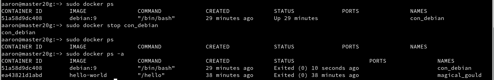

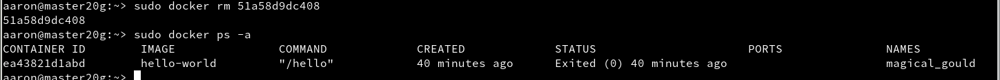


## 4. Crear contenedor a partir de nuestra imagen

### 4.1. Crear contenedor con Nginx

### 4.2. Buscar los puertos de salida

## 5. Crear un contenedor a partir de un Dockerfile

### 5.1. Comprobaciones iniciales

### 5.2. Preparar ficheros

### 5.3. Crear imagen a partir del Dockerfile

### 5.4. Crear contenedor y comprobar

## 6. Migrar las imágenes de docker a otro servidor


### 6.1. Exportar

### 6.2. Importar

## 7. Limpiar
